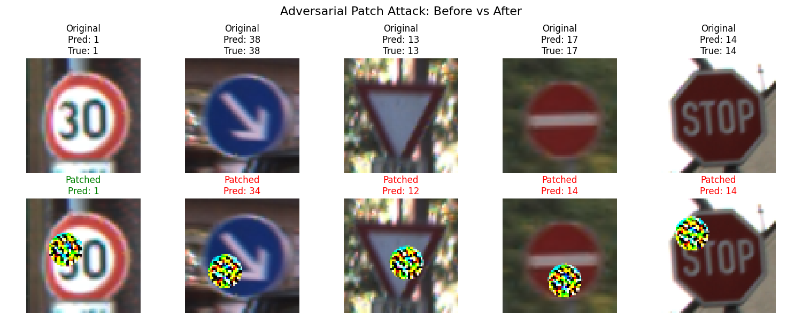
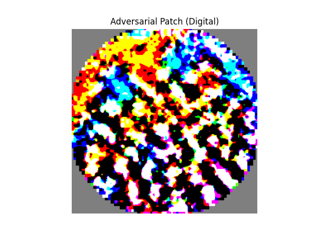

# 🛑 Traffic Sign Recognition: Adversarial Patch Attack


## 📌 Project Overview
This project explores the vulnerability of deep learning models used in autonomous driving to **Physical Adversarial Attacks**. Specifically, it demonstrates how to generate an **Adversarial Patch** that, when applied to a traffic sign, completely fools a convolutional neural network (CNN) while remaining a localized, printable perturbation.

We trained a **ResNet18** model on the **German Traffic Sign Recognition Benchmark (GTSRB)** and utilized the **Adversarial Robustness Toolbox (ART)** to generate targeted adversarial patches. 

Our goal is to force the model to misclassify critical traffic signs (e.g., *Stop*, *Yield*, *No Entry*) as a specific incorrect target class (e.g., *Speed Limit 30 km/h*).

### 📊 Attack Results
Here is the visual representation of our physical adversarial attack:



And here is the generated digital patch:




## 🗂️ Project Structure

```text
traffic-sign-recognition-adv-attacks/
│
├── data/                       # GTSRB dataset (downloaded automatically)
├── models/                     # Saved model weights
│   └── gtsrb_resnet18.pth      # Trained ResNet18 weights (generated after Step 1)
├── src/
│   ├── train_model.py          # Script to download data and train the target ResNet18 model
│   ├── baseline_test.py        # Script to evaluate clean model accuracy
│   └── generate_patch.py       # Core script to generate the adversarial patch and visualize results
│
├── .gitignore                  # Git ignore file
└── README.md                   # Project documentation